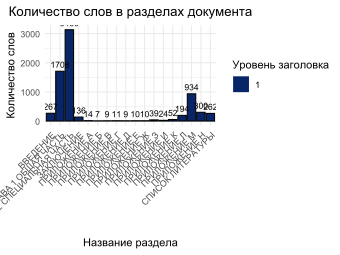

### WChart

(Word) Chart simple script which 
counts words for every region in Microsoft Word 
document.
Also makes `*.csv` and `.svg` report

| heading_level | "title" | "word_count" |
|---------------|---------|--------------|
|"1"  | "ВВЕДЕНИЕ" | 267
|"1"  | "ГЛАВА 1 ОБЩАЯ ЧАСТЬ" | 1708
|"1"  | "ГЛАВА 2 СПЕЦИАЛЬНАЯ ЧАСТЬ" | 3133
|"1"  | "ЗАКЛЮЧЕНИЕ" | 136
|"1"  | "СПИСОК ЛИТЕРАТУРЫ" | 262
|"1"  | "ПРИЛОЖЕНИЕ А" | 14
|"1"  | "ПРИЛОЖЕНИЕ Б" | 7
| ... | ...            | ...

